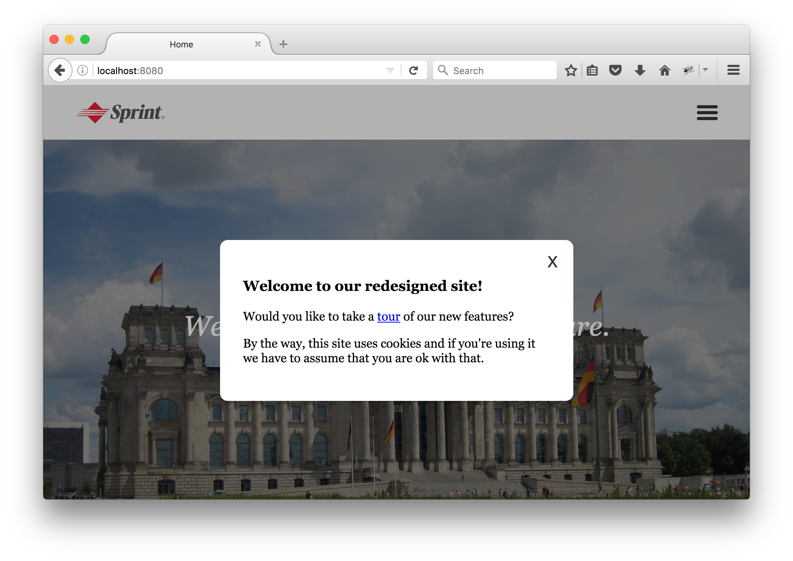

## Exercises

1. Refactor your <a href="wk2_dy4_ticker">ticker project</a> to use jQuery for all DOM manipulations.

   #### My [solution](text)


2. Using jquery, create a modal dialog for your 'Welcome to Berlin and the Future' page. A modal dialog is a popup that users must interact with before they can do anything else. Typically, modals on website involve a box of content sitting on top of a semi-transparent background that fills the browser window.

   Your modal should appear 1 second after users arrive at the page. The modal should disappear when the user clicks the X in the upper right corner.

   #### My [solution](text)

​	




# jQuery

jQuery is probably the most widely used Javascript library of all time. It's popularity seems to have peaked and entered decline, primarily because many of the problems it solves have become less significant as browsers have improved and become more consistent. However, it is still incredibly widely used and it is very likely you will encounter it on projects in the future.

jQuery provides <a href="http://api.jquery.com/">tons of methods</a> designed to help you traverse the DOM tree, manipulate elements, make ajax requests, and handle user action.

## DOM

When you include jQuery, it creates two global variables, `jQuery` and `$`, both of which refer to the same thing: a function that returns jQuery objects.

If you pass a selector to this function, it returns an object representing any elements on the page that match the selector. Note that it _does not_ return the elements themselves. The object it returns has references to the elements themselves, but you usually do not need to access them. The jQuery object _wraps_ the elements. When you call methods on the jQuery object, it acts upon the elements without the methods being directly attached to them.

Most jQuery methods return the object they belong to, which allows you to _chain_ your method calls.

```js
$('h1').css({
    color: 'red'
}).html('jQuery is pretty great!');
```

In this example, the `style.color` and `innerHTML` of _all_ `<h1>` elements of the page have been changed. No loop is required.

If you pass a string containing HTML content to `jQuery` or `$`, it creates the element(s).

```js
$('<div>I love jQuery!</div>').css({
    textDecoration: 'underline'
}).addClass('happy').appendTo('body');
```

If you pass a reference to an element to `jQuery` or `$`, a wrapped object is returned.

```js
$(document.body).css('backgroundColor', '#fff');
```

It is common for jQuery methods that are setters (such as <a href="http://api.jquery.com/attr/">`attr`</a>, <a href="http://api.jquery.com/val/">`val`</a>, and <a href="http://api.jquery.com/html/">`html`</a>) to also be getters. If they are not passed a value to set, they return the current value.

## Events

jQuery has had several different APIs for adding and removing event listeners through the years (`bind`/`unbind`, `live`/`die`, `delegate`/`undelegate`). The current methods to use for this are <a href="http://api.jquery.com/on/">`on`</a> and <a href="http://api.jquery.com/off/">`off`</a>.

```js
$('.pretty').on('mousedown', function fn(e) {
    console.log(e.currentTarget.id);
    $(e.currentTarget).off('mousedown', fn);
});
```

jQuery allows you to give events a _namespace_, which is very handy for removing listeners without references to the functions themselves.

```js
$('a').on('mouseover.removeAfterFirstClick', function() {
    console.log('mouseover!');
}).on('click.removeAfterFirstClick', function(e) {
    $(e.currentTarget).off('.removeAfterFirstClick'); //removes all events in the removeAfterFirstClick namespace
});
```

You can give events arbitrary names and trigger them at will.

```js
$('body').on('whatever', function() {
    console.log('The "whatever" event happened');
}).trigger('whatever');
```

jQuery also supports creating <a href="http://benalman.com/news/2010/03/jquery-special-events/">custom events</a> that are composites of other events.

## Including jQuery

In order to use jquery, you have to include it with a `script` tag in your HTML. You can either download the [latest version](http://jquery.com/download/) or include it from the CDN like so:

```html
<script src="https://code.jquery.com/jquery-3.3.1.min.js"></script>

```

1. 
